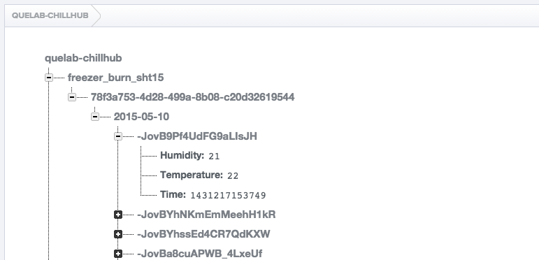

# Data Logger
This is a universal data logger for any chillhub devices. It uses the same configuration file 'chillhub.json' as the chillhub 'firmware'.

## Features
* Uses Server Unix Timestamp
* Creates a new log every day based on server timestamp.
* automatically discovers data to log based on default chillhub data structure.

## Installation
npm install

## Example (Invalid) Configuration
```javascript
{
    "firebaseUsername": "derp@derp.com",
    "firebasePassword": "1234",
    "firebaseUrl": "https://yourfirebase.firebaseio.com",
    "token": "asdkfjas;dkfjkasjdfkjsakfjjfkajsdfljasl;kdjf;lksajdf",
    "uuid": "7de17d1d-cd97-477f-893c-49ed34595f46"
}
```

## Console Output
```bash
node logger.js
```

```
Config file opened.
Successful firebase login.
Connected to firebase, configuring loggers.
[ 'freezer_burn_sht15' ]
2015-05-10T00:19:13.621Z
https://quelab-chillhub.firebaseio.com/users/simplelogin%3A1/devices/chillhubs/d84f6894-b3c0-4dd5-9b82-5632b8a7d1ce/freezer_burn_sht15/78f3a753-4d28-499a-8b08-c20d32619544
https://quelab-chillhub.firebaseio.com/freezer_burn_sht15/78f3a753-4d28-499a-8b08-c20d32619544/2015-05-10
{ Humidity: 21, Temperature: 22, Time: { '.sv': 'timestamp' } }
https://quelab-chillhub.firebaseio.com/freezer_burn_sht15/78f3a753-4d28-499a-8b08-c20d32619544/2015-05-10
{ Humidity: 25, Temperature: 22, Time: { '.sv': 'timestamp' } }
...
```

## FireBase format


https://firebaseurl/device_type/device_uuid/YYYY-MM-DD/client_timestamp/

```javascript
{
  "Sensor1":value,
  "SensorN":value,
  "Time":UNIX_EPOCH
}
```