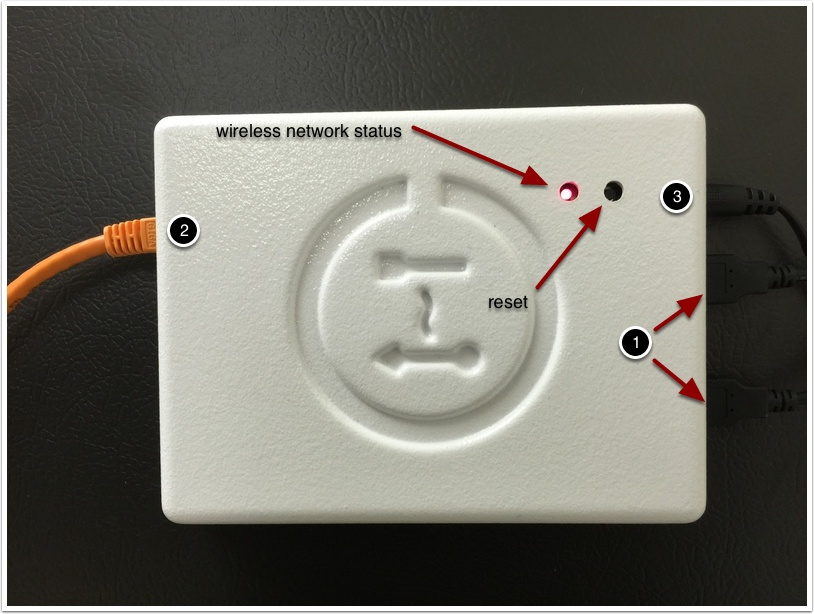

# Green Bean Connect Kit Setup

## Physical Connections:


1. 2 USB Hubs 
2. 1 Ethernet Port  
3. 1 Power Supply 

## Network Connection
### Overview
The steps to setup the GBCK seem pretty straight forward, but there are multiple ways to accomplish them, and some ways may apply only to certain revisions of the firmware.

1. Connect to the GBCK as a hotspot using the wifi name and password printed on the enclosure
2. Configure the GBCK to use the Quelab Wireless Network
3. Use the GBCK

### Connect to the GBCK as a hotspot
Copied from [FirstBuild Instructions](https://firstbuild.com/mylescaley/green-bean-connect-kit/activity/)

```
To use ssh to connect to your GBCK, you will need to do a few things.

First, you need to install the green-bean-connect-utils from github:

git clone https://github.com/FirstBuild/green-bean-connect-utils
cd green-bean-connect-utils/configuration
npm install

Next, you need to get the IP address of your GBCK. Look on the bottom of your GBCK. You need the Firebase User name and the Firebase Pass. For example, your Firebase User might be connected-firehouse@firebase.com and your Firebase Pass might be jobbylu. With these two pieces of information, run the following command, substituting your own Firebase User and Pass:

node sandbox-data.js connected-firehouse@firebase.com jobbylu

Something like the following should print, assuming the LED on your GBCK is solid:
```

```javascript
{
  "devices": {
    "chillhubs": {
      "0ec150f0-d259-11e4-9a59-afb430376951": { "ip_address": "10.202.9.131" }
    }
  }
}
```

```
You should now have the IP address of your GBCK. Now you can use SSH to connected to your GBCK by typing the following, replacing the IP address below with the IP address of your GBCK:

ssh root@10.202.9.131

When prompted, use 'root' as your password without the quotation marks.
```

### Hacktastic Method 2

1. Hit the reset button on the GBCK, The LED light next to it will eventually flash if it doesn't then unplug the device and try again. 
2. When the LED is flashing the GBCK is in AP mode which means you can connect to it as if you are connecting to any other wireless router. The Wireless network name and WPA2 password is printed on one of the sides of the GBCK box. Use these to connect to the device. 
3. After you've established a wireless connection to the device ssh as root: `ssh root@192.168.10.1` and run the following command pifi wlan0 -w "QuelabDSL" "<quelabwifipw goes here>". At this point the device should reboot and connect to the Quelab wireless. 
4. If the GBCK isn't off for too long it appears our wireless router will assign it a dhcp address of 10.1.10.161. If it is on that IP you can login as root. If it isn't on that address ... good luck ... I mean either of the following might help you to find the host (in either case you'll figure out which IPs the network connected printers are on):
    * ping -c 1 10.1.10.255 ; arp -a
    * nmap -sP 10.1.10.1/24

## Cloud Connection
The GBCK software expects to talk to FireBase which is a database in the cloud. There is a way to use the BuildFirst sandbox apparently, but probably don't bother just create a new account and configure the GBCK to talk to it.

1. Setup an account on [FireBase](http://firebase.com) The free tier account will be just fine.
2. Click through the tutorial until you get to your dashboard where you can create an app.
3. After you've created your app you will need to enable email + password based authentication. Login & Auth => Email & Password => Enable Email & Password Authentication
4. On the bottom of this same screen you can add a user account for your app. You can also add a user automatically from the command line using the [GenerateFirebaseLoginAndToken script](https://github.com/FirstBuild/green-bean-connect-utils/blob/master/configuration/generateFirebaseLoginAndToken.js) There are instructions on the readme that seem to suggest you can do all of the [Network + Cloud setup](https://github.com/FirstBuild/green-bean-connect-utils/tree/master/configuration) with a couple of scripts too. Haven't tried it. I did create a different generate [script](https://github.com/Quelab/green-bean-connect-utils/blob/master/configuration/generateGreenBeanConnectConfig.js) that creates a user + uuid configuration for the device. 
5. The generated configuration file needs to find its way to */root/chillhub-firmware/share/config/chillhub.json* on the device.
